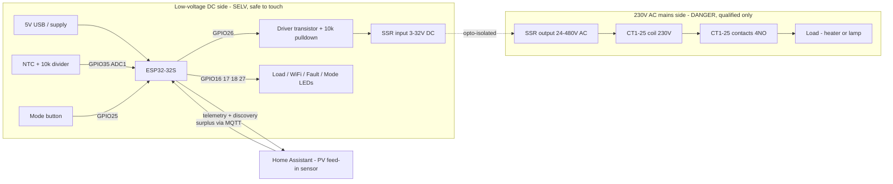
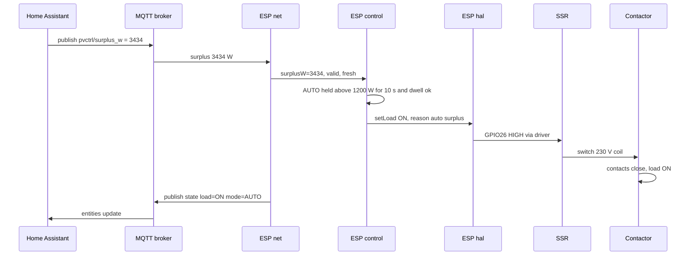
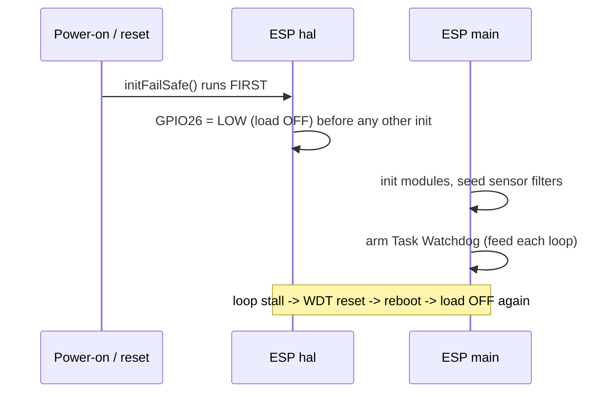

# ESP32-32S PV Surplus Load Controller — Firmware v1

First firmware version for an ESP32-WROOM-32 (`esp32dev`, 30-pin "ESP32-32S")
that switches a resistive load when there is surplus PV power, with a manual
override and a hard thermal cut-out. Built with the Arduino-ESP32 core under
PlatformIO.

> **HARD SAFETY BOUNDARY — the ESP32 never switches mains.**
> Switching chain:
> `GPIO26` -> low-voltage transistor/driver stage -> **Ailao GSR2-1-10DA** SSR
> input (3-32 V DC) -> SSR output switches the 230 V AC coil of a **Heschen
> CT1-25** contactor -> the contactor switches the actual load.
> The microcontroller only drives a low-voltage SSR input. It never touches
> 230 V.

The control loop is **local-first**: the switching decision, all faults, and the
fail-safe always run on the ESP32. The default build adds **WiFi + MQTT (Home
Assistant)** so the PV surplus is read from HA and the mode/thresholds are set
from HA — but a lost link or a stale/invalid surplus always collapses to the safe
state (load OFF), and local FAULT/OFF priority is never overridden by a remote
command. See **§12** for the Home Assistant integration. For a pure offline
controller (local selector + local ADC surplus), build with `-D ENABLE_WIFI=0`.
OLED remains an optional, disabled no-op seam.

---

## System overview — block, wiring & sequence

### Block & wiring overview



> The **SSR is the galvanic isolation boundary** between the ESP/low-voltage side
> and the 230 V mains side — the ESP never touches mains.
> **Current build:** surplus comes from Home Assistant over MQTT. The local mode
> button (GPIO25) + mode LED (GPIO27) are implemented and work without WiFi (mode:
> local button and HA, last change wins). GPIO34 (local ADC surplus) is an
> optional, default-off fallback.

### Power path & driver detail (build-critical)

```text
  DC control side (SELV, safe)            |   230 V AC mains (isolated by SSR)
  --------------------------------------- | ----------------------------------------
  +5V/+12V ───────────────► SSR "+"       |   L ─► SSR output ─► CT1-25 coil ─► N
  GPIO26 ─[220R]─► G (logic MOSFET)       |        (SSR sits in series with coil)
                  D ◄─────── SSR "−"      |
                  S ───────► GND(=supply) |   L1 ─► CT1-25 contact ─► Load ─► N
  Gate ─[10k]─ GND  (fail-safe pulldown)  |        (contactor switches the load)
```

- GPIO26 HIGH → MOSFET conducts → SSR input energized → SSR closes → coil → contactor → load ON.
- Common ground between the ESP and the SSR-input supply is mandatory.
- NTC divider (see §2): `3V3 — NTC — GPIO35 — 10k — GND`.
- **Mandatory:** the 10k gate pulldown keeps the SSR OFF during boot/reset/brownout.

### Sequence — AUTO surplus-driven switch-on



### Sequence — fault / fail-safe (overtemp, lost or invalid surplus)

```mermaid
sequenceDiagram
    participant SRC as Sensor / link
    participant CTL as ESP control
    participant HAL as ESP hal
    participant SSR as SSR
    participant K as Contactor
    SRC-->>CTL: temp above 70 C OR surplus invalid/stale
    CTL->>CTL: detectFaults, latch, FAULT has top priority
    CTL->>HAL: setLoad OFF, reason fault
    HAL->>SSR: GPIO26 LOW
    SSR->>K: coil de-energized
    K->>K: contacts open, load OFF
    Note over CTL: stays OFF until healthy; PV/stale auto-clear, others need ack
```

### Sequence — boot fail-safe



---

## 1. Build & flash

Install [PlatformIO](https://platformio.org/) (CLI or the VS Code extension),
then from the `firmware/` directory:

```sh
pio run                 # compile
pio run -t upload       # compile + flash over USB
pio device monitor      # serial monitor @ 115200 baud
```

The default build has `ENABLE_WIFI 1` and `ENABLE_OLED 0` in `src/config.h`. With
WiFi on you must first provide credentials (see **§12.1**):

```sh
cp firmware/src/secrets.example.h firmware/src/secrets.h   # then edit secrets.h
```

`secrets.h` is git-ignored. With placeholder credentials the firmware still
compiles and boots; it simply keeps retrying to connect while the load stays
safely OFF.

The feature flags are `#ifndef`-guarded, so a command-line `-D` override wins (no
redefinition warning, no silent clobber). For a **pure offline build** (no WiFi
libraries, local selector + local ADC surplus):

```sh
pio run -e esp32dev --build-flag "-D ENABLE_WIFI=0"
```

> OLED is still a no-op stub in this version; enabling `-D ENABLE_OLED=1` compiles
> the seam but adds no display behavior yet.

---

## 2. Pin map & per-signal wiring notes

| GPIO | Name          | Direction        | Notes |
|------|---------------|------------------|-------|
| 26   | `PIN_LOAD`    | Digital OUT      | SSR/contactor **driver** input. Default LOW/OFF at boot. Only pin written by `setLoad()`. **Requires an external pulldown on the driver stage** (see §7). |
| 25   | `PIN_BTN`     | INPUT_PULLUP     | Mode/multifunction button, active-low (to GND), debounced. Short press cycles OFF->AUTO->MANUAL; long press (>=3 s) toggles the load in MANUAL, or acknowledges a latched fault. |
| 32   | `PIN_MODE_A`  | (reserved)       | Free GPIO (e.g. a future dedicated manual button). |
| 33   | `PIN_MODE_B`  | (reserved)       | Free GPIO. |
| 34   | `PIN_PV`      | ADC1 IN (in-only)| PV surplus analog 0-3.3 V. **No internal pull-up** (input-only pin). Provide an external bias/source network in hardware. |
| 35   | `PIN_NTC`     | ADC1 IN (in-only)| NTC divider node. **No internal pull-up.** |
| 21   | `PIN_OLED_SDA`| I2C SDA          | Only used if `ENABLE_OLED`. |
| 22   | `PIN_OLED_SCL`| I2C SCL          | Only used if `ENABLE_OLED`. |
| 16   | `PIN_LED_LOAD`| Digital OUT      | Load status LED (on = load energized). |
| 17   | `PIN_LED_WIFI`| Digital OUT      | WiFi/HA LED: solid = MQTT connected, blink = WiFi only, off = no network. |
| 18   | `PIN_LED_FAULT`| Digital OUT     | Fault LED. **Blinks ~1 Hz while any fault is latched** (signals "needs operator clear"). |
| 27   | `PIN_LED_MODE` | Digital OUT     | Mode LED: off = OFF, ~1 Hz blink = AUTO, solid = MANUAL. |

**Pin-safety rules honored:** never GPIO6-11 (SPI flash); GPIO34/35 are
input-only and have no internal pull-up; both analog channels are on **ADC1**
(ADC2 is unusable when WiFi is later enabled). All ESP32 logic is 3.3 V only —
do not feed 5 V into any pin.

### Local control: mode button (GPIO25) + mode LED (GPIO27)

A single momentary push-button on GPIO25 (to GND) drives the local UI; one mode
LED on GPIO27 shows the selected mode:

| Button action | Effect |
|---------------|--------|
| **Short press** | Cycle the mode: OFF -> AUTO -> MANUAL -> OFF. |
| **Long press (>=3 s) in MANUAL** | Toggle the load ON/OFF. |
| **Long press (>=3 s) while faulted** | Acknowledge / clear the latched fault. |

| Mode LED (GPIO27) | Meaning |
|-------------------|---------|
| off | OFF mode |
| ~1 Hz blink | AUTO mode |
| solid on | MANUAL mode |

The local button works **independently of WiFi**. Home Assistant can also set the
mode (its `Mode` select); the **last change wins** (local or remote). A local OFF
and any FAULT always force the load off and override any remote command.
(`PIN_MODE_A`/`PIN_MODE_B` are now free; the old 2-bit selector decode is gone.)

### NTC divider

```
3V3 -- NTC -- node(GPIO35) -- Rfixed(10k) -- GND
```

`V_node = Vsupply * Rfixed / (Rntc + Rfixed)`, so `V_node` **rises** as
temperature rises (Rntc falls). HIGH node = hot, LOW node = cold/open.
`Rntc = Rfixed * (Vsupply/V_node - 1)`, then the Beta equation
`1/T = 1/T0 + (1/Beta)*ln(Rntc/R0)`. With `Rfixed = R0 = 10 k`, the node sits at
~1/2*Vsupply at 25 C, maximizing resolution around room temperature.

---

## 3. Operating modes & priority

Strict descending priority, re-evaluated every control tick:

1. **FAULT** — any fault latched -> load OFF (cannot be overridden).
2. **OFF** — mode OFF -> load OFF.
3. **MANUAL** — load follows the manual latch (local long-press or HA switch).
4. **AUTO** — PV surplus hysteresis with on/off delays and minimum dwell.

Fault detection runs **before** mode handling, so a fault arising mid-MANUAL or
mid-AUTO de-energizes the load within one tick.

### AUTO control

- Switch **ON** only if `surplus > SURPLUS_ON_THRESHOLD_W` held continuously for
  `SWITCH_ON_DELAY_MS`, **and** `MINIMUM_DWELL_TIME_MS` has elapsed since the
  last load change.
- Switch **OFF** if `surplus < SURPLUS_OFF_THRESHOLD_W` held continuously for
  `SWITCH_OFF_DELAY_MS`.
- `SURPLUS_OFF < SURPLUS_ON` provides hysteresis (enforced by `static_assert`).
- The delay timers measure **continuous** hold and reset when the condition
  lapses, so intermittent spikes cannot accumulate to a false switch.
- **Dwell** suppresses only ON transitions **in AUTO** (anti-cycling); OFF
  transitions (and all FAULT/OFF forced-off actions) are immediate — safety
  always wins. **MANUAL is never dwell-gated**: a local button press takes effect
  immediately.
- The ON decision is **re-validated at the moment the dwell gate releases**: if
  the surplus has fallen out of the ON region (into the dead-band or below) while
  the dwell timer was running, the pending ON is abandoned, so the load is never
  energized on a stale threshold crossing.

---

## 4. Configuration table (`src/config.h`)

| Constant | Default | Unit | Meaning |
|----------|---------|------|---------|
| `ENABLE_WIFI` | 1 | — | WiFi + MQTT (Home Assistant). Set 0 for pure-local. See §12. |
| `ENABLE_OLED` | 0 | — | OLED display seam (no-op stub). |
| `ENABLE_SERIAL_DEBUG` | 1 | — | Periodic telemetry + transition logging. |
| `SURPLUS_ON_THRESHOLD_W` | 1200 | W | AUTO switch-on threshold. |
| `SURPLUS_OFF_THRESHOLD_W` | 800 | W | AUTO switch-off threshold (must be < on). |
| `SWITCH_ON_DELAY_MS` | 10000 | ms | Hold above on-threshold before energizing. |
| `SWITCH_OFF_DELAY_MS` | 5000 | ms | Hold below off-threshold before de-energizing. |
| `MINIMUM_DWELL_TIME_MS` | 30000 | ms | Min time between ON transitions (anti-cycling, AUTO only). |
| `TEMPERATURE_LIMIT_C` | 70 | C | Overtemperature fault threshold. |
| `OVERTEMP_CLEAR_MARGIN_C` | 5 | C | Overtemp recovery hysteresis (clears below limit-margin). |
| `PV_SURPLUS_FULL_SCALE_W` | 3680 | W | Watts at full-scale ADC (230 V x 16 A reference). |
| `ADC_VREF_MV` | 3300 | mV | ADC/divider full scale (nominal; see §7). |
| `PV_RAIL_FLOOR_MV` / `PV_RAIL_HIGH_MV` | 2 / 3270 | mV | Hard fault window; a near-zero reading is a **legitimate 0 W** surplus, so only a hard floor (impossible front-end) or the high rail (shorted) -> PV invalid. |
| `NTC_R_FIXED` | 10000 | ohm | Fixed divider resistor (node->GND). |
| `NTC_BETA` | 3950 | — | NTC Beta (B25/50). |
| `NTC_R0` | 10000 | ohm | NTC nominal resistance at T0. |
| `NTC_T0_K` | 298.15 | K | Reference temperature (25 C). |
| `NTC_VSUPPLY_MV` | 3300 | mV | Divider supply rail for V->R math. |
| `NTC_OPEN_MV` / `NTC_SHORT_MV` | 100 / 3200 | mV | Open/short detection thresholds. |
| `NTC_TEMP_MIN_C` / `NTC_TEMP_MAX_C` | -50 / 90 | C | Valid sensor range. |
| `ADC_OVERSAMPLE` | 16 | — | Calibrated-mV reads averaged per measurement. |
| `EMA_ALPHA` | 0.20 | — | EMA smoothing factor (PV + NTC). |
| `SAMPLE_INTERVAL_MS` | 50 | ms | Sensor sampling cadence. |
| `CONTROL_TICK_MS` | 100 | ms | State-machine evaluation cadence. |
| `STATUS_INTERVAL_MS` | 2000 | ms | Serial telemetry cadence. |
| `DEBOUNCE_MS` | 30 | ms | Button debounce window. |
| `FAULT_ACK_LONGPRESS_MS` | 3000 | ms | Button hold to acknowledge/override faults. |
| `FAULT_RECOVERY_HOLD_MS` | 5000 | ms | Conditions must read healthy this long before a clear is allowed. |
| `TEMP_STALE_MS` | 500 | ms | Max NTC sample age before its heartbeat is lost (-> `FAULT_SENSOR_STALE`). |
| `PV_STALE_MS` | 90000 / 500 | ms | Max PV value age before stale. 90 s with WiFi (slow network feed); 500 ms for the local ADC build. |
| `WATCHDOG_TIMEOUT_S` | 5 | s | Task Watchdog timeout; a loop stall past this resets the chip -> load OFF. |
| `SURPLUS_SOURCE_MQTT` | 1 / 0 | — | 1 (WiFi build): surplus from HA over MQTT. 0: local ADC (GPIO34). Mode is always runtime button + HA, not a compile flag. |
| `ENABLE_LOCAL_SURPLUS_FALLBACK` | 0 | — | If 1: when the MQTT surplus goes stale, AUTO falls back to the local ADC (GPIO34) instead of faulting. Needs a real sensor on GPIO34. |
| `MQTT_STATE_PUBLISH_MS` | 5000 | ms | Telemetry publish cadence to HA. |
| `SURPLUS_PLAUSIBLE_MIN_W` / `_MAX_W` | -100000 / 100000 | W | Plausibility window for the received feed-in power. |

---

## 5. ADC measurement notes

- Both channels use `analogReadMilliVolts()` (per-chip eFuse calibration), **not**
  raw `analogRead()`, to compensate for the ESP32 ADC's nonlinearity and
  reference spread. Attenuation is `ADC_11db` for the ~0-3.3 V range.
- Each measurement oversamples `ADC_OVERSAMPLE` reads, then feeds an EMA. Filters
  are **pre-seeded** at boot so the first control evaluation sees a settled value
  (no cold-start spurious fault, and no transient that could momentarily read as
  a valid ON-permitting surplus).
- **PV:** a near-zero reading is a **legitimate 0 W** surplus (night/clouds/no
  export), so it is **not** a fault — it clamps to 0 W. Only a *hard* floor
  (`< PV_RAIL_FLOOR_MV`, an impossible reading for a healthy front-end) or the
  high rail (`> PV_RAIL_HIGH_MV`, shorted) raises `FAULT_PV_INVALID`. This keeps
  unattended AUTO from latching off every evening. Otherwise
  `W = mV/ADC_VREF_MV * PV_SURPLUS_FULL_SCALE_W`, clamped to `[0, full-scale]`.
- **Heartbeat:** each sample path stamps a last-sample timestamp; if the age
  exceeds `PV_STALE_MS` / `TEMP_STALE_MS` (sample loop wedged, ADC stuck, or the
  MQTT surplus feed stalled), control raises `FAULT_SENSOR_STALE` so a frozen
  reading cannot silently keep the load energized.
- **NTC:** open/short rails are classified **before** any math (no
  divide-by-zero / log-of-negative). A computed temperature outside the valid
  range is `OUT_OF_RANGE`. Overtemp is checked **only** when the NTC reads OK, so
  an unreadable sensor can never silently mask a real overtemperature — it faults
  for a different reason instead.

---

## 6. Fault model

`FaultCode` is a bitmask; multiple faults can latch and be reported together.
Each fault forces the load OFF immediately.

| Bit | Fault | Trigger | Clear policy |
|-----|-------|---------|--------------|
| 0x01 | `FAULT_PV_INVALID` | PV reading below the hard floor or above the high rail (shorted/broken front-end). A legitimate 0 W is **not** a fault. | **Clear-on-recovery** (no ack) |
| 0x02 | `FAULT_NTC_OPEN` | NTC node <= `NTC_OPEN_MV` (Rntc -> inf, broken wire). | Healthy-hold + ack |
| 0x04 | `FAULT_NTC_SHORT` | NTC node >= `NTC_SHORT_MV` (Rntc -> 0, shorted). | Healthy-hold + ack |
| 0x08 | `FAULT_NTC_RANGE` | Computed temperature outside `[-50, +90] C`. | Healthy-hold + ack |
| 0x10 | `FAULT_OVERTEMP` | Healthy NTC reads > `TEMPERATURE_LIMIT_C`. | Healthy-hold + ack |
| 0x20 | `FAULT_MODE_SELECTOR` | Reserved — **not raised** (no hardware selector; mode is button + HA). | n/a |
| 0x40 | `FAULT_SENSOR_STALE` | A feed stopped producing fresh readings (age > `PV_STALE_MS` / `TEMP_STALE_MS`): wedged loop, stuck ADC, or stalled MQTT surplus. | **Clear-on-recovery** (no ack) |
| 0x80 | `FAULT_INTERNAL` | Self-consistency / invariant violation (e.g. an impossible mode reaching the AUTO/MANUAL default branch). | **Manual override only** (long-press) |

### Latching policy (default safe)

Faults **latch** and force the load OFF. Clearing depends on the fault class:

1. **Clear-on-recovery (no ack)** — `FAULT_PV_INVALID` and `FAULT_SENSOR_STALE`.
   The PV surplus is an environmental signal that can momentarily rail, and a
   (network/MQTT) feed can briefly stop and resume; requiring a human after every
   transient would defeat unattended AUTO. They auto-clear once the condition is
   healthy again continuously for `FAULT_RECOVERY_HOLD_MS`. They still force OFF
   while active, and the AUTO ON path re-validates the live surplus before
   energizing, so a transient can never energize the load.
2. **Healthy-hold + operator acknowledge** — the NTC/overtemp faults. Clear only
   when **every** self-recoverable latched condition reads healthy continuously
   for `FAULT_RECOVERY_HOLD_MS` (overtemp uses a 5 C clear margin) **and** an
   explicit ack is given: cycle the mode to **OFF**, **long-press** the button
   (>= `FAULT_ACK_LONGPRESS_MS`), or press HA **Fault Reset**.
3. **Manual override only** — `FAULT_INTERNAL` has no self-measurable healthy
   reading, so it clears only via a manual **long-press override** (once the
   recoverable faults are also healthy). A reset clears it too.

No safety fault auto-cycles a high-power load silently — a human stays in the
loop for everything except a transient PV rail. On a *full* clear (all bits
gone), the manual latch is reset OFF and AUTO timers reset, so re-energizing
requires a fresh affirmative action.

---

## 7. Fail-safe design

1. **Boot:** `hal::initFailSafe()` is the literal first statement in `setup()` —
   `pinMode(GPIO26, OUTPUT); digitalWrite(GPIO26, LOW)` — before Serial, config,
   or any module init. The load cannot be energized during init.
2. **Single choke-point:** GPIO26 is written **only** inside `hal::setLoad()`. It
   mirrors the logical contactor state, is idempotent, and serial-logs every
   transition with a timestamp and reason. No other code writes GPIO26.
3. **Default-deny:** the load is OFF unless an affirmative MANUAL/AUTO decision is
   made with zero active faults. FAULT and OFF are evaluated first and force OFF.
4. **Latching faults:** see §6.
5. **Sensor distrust:** open/short/railed analog inputs produce explicit faults,
   never a default "safe-looking" value that could permit ON.
6. **Non-blocking:** no `delay()` in steady state; all timing uses overflow-safe
   `millis()` subtraction.
7. **Stall-to-safe watchdog:** the ESP32 Task Watchdog is armed at the end of
   `setup()` (`WATCHDOG_TIMEOUT_S`, panic-on-timeout) and fed once per `loop()`.
   If `loop()` ever hangs (blocking call, wedged ADC, future seam bug), the WDT
   starves and the chip panics/resets; on reboot `hal::initFailSafe()` drives
   GPIO26 LOW first thing, so a stall converts to **load OFF** instead of freezing
   the contactor in its last commanded state.
8. **Sensor heartbeat:** stale sample paths raise `FAULT_SENSOR_STALE` so a frozen
   reading cannot keep the load energized without live supervision.

### REQUIRED external hardware: pulldown on the driver stage

During ESP32 reset, brown-out, boot strapping, or power loss, GPIO26 is briefly
high-impedance before `setup()` drives it LOW. **You must fit an external
pulldown resistor (e.g. 10 kohm) on the GPIO26 driver-stage input** so the SSR
input stays de-asserted in that window. GPIO26 was chosen specifically because
it is **not** a strapping pin. On loss of ESP32 supply the contactor coil
de-energizes and the load drops out inherently — but the firmware must never
rely on software alone to hold OFF across a reset.

**SSR leakage note:** verify physically that the contactor actually drops out
(coil current below hold) when the driver is OFF; SSR off-state leakage is a
hardware concern outside firmware control. v1 has no contactor feedback — the
software "contactor state" is a *commanded* mirror, not a *confirmed* one.

---

## 8. Manual test checklist (GPIO / button / LED)

Use the serial monitor (115200) to observe transitions. Perform with the load
disconnected first (dry test).

- [ ] **Boot:** on reset, load LED off, GPIO26 measures LOW *before* the boot
      banner prints; no LED falsely on.
- [ ] **Mode cycle:** short presses cycle OFF -> AUTO -> MANUAL -> OFF; the mode
      LED follows (off / blink / solid) and serial `mode=` updates. The HA `Mode`
      select changes it too (last change wins).
- [ ] **OFF mode:** load stays OFF in all conditions.
- [ ] **MANUAL mode:** a long press (or the HA Manual switch) toggles the load LED
      ON/OFF; serial logs `LOAD ON/OFF (manual ...)`.
- [ ] **Button debounce:** rapid taps do not produce double toggles.
- [ ] **AUTO mode:** publish a surplus above 1200 W to `pvctrl/surplus_w` (or use
      the HA automation); confirm load turns ON only after the on-delay **and** the
      dwell window; drop below 800 W, confirm OFF after the off-delay.
- [ ] **NTC open:** unplug the NTC -> fault LED blinks, `faults=0x02`, load OFF.
- [ ] **NTC short:** short the NTC -> `faults=0x04`, load OFF.
- [ ] **Overtemp:** warm the NTC above 70 C -> `faults=0x10`, load OFF.
- [ ] **PV invalid:** short the PV input to the rail (or drive it below the hard
      floor) -> `faults=0x01`, load OFF. A genuine 0 V / 0 W reading must **not**
      fault (AUTO stays armed).
- [ ] **PV auto-recovery:** restore a plausible PV reading -> `FAULT_PV_INVALID`
      clears on its own after the recovery hold (no button press needed).
- [ ] **Sensor stale:** (bench) stall the sample loop / freeze the ADC feed ->
      `faults=0x40`, load OFF.
- [ ] **Fault clear:** with all conditions healthy, cycle the mode to OFF,
      long-press the button (>=3 s), or press HA "Fault Reset" -> fault clears
      after the recovery hold; load stays OFF until a fresh MANUAL/AUTO request.
      A long-press / Fault Reset also clears a latched `FAULT_INTERNAL` (0x80).
- [ ] **MANUAL is immediate:** in MANUAL, a long-press (or the HA switch) toggles
      the load with no dwell delay, even right after an AUTO->MANUAL switch.
- [ ] **Watchdog:** (bench) inject a long busy-loop in `loop()` -> the chip resets
      within ~`WATCHDOG_TIMEOUT_S` and comes back with the load OFF.
- [ ] **LEDs:** load LED tracks load; fault LED blinks only while faulted; mode
      LED off/blink/solid = OFF/AUTO/MANUAL; WiFi LED solid when MQTT connected.

---

## 9. Verification checklist

- [ ] Default build (`ENABLE_WIFI 0`, `ENABLE_OLED 0`) compiles and runs with no
      network and no OLED.
- [ ] Feature flags are `#ifndef`-guarded; `-D ENABLE_OLED=1` overrides without a
      redefinition warning.
- [ ] GPIO26 is forced OFF as the first action in `setup()`.
- [ ] `digitalWrite(PIN_LOAD, ...)` appears in exactly one steady-state writer:
      `hal::setLoad()`. (Grep check: `grep -rn "PIN_LOAD" src` — only `config.h`,
      `initFailSafe`, `init`, and `setLoad` reference it; only `setLoad` ever
      drives it HIGH.)
- [ ] Mode is set by the local button (cycle) AND HA (last change wins) and is
      never published as INVALID (the selected mode survives a fault).
- [ ] PV mV->W mapping with rail plausibility fault (0 W is not a fault).
- [ ] NTC mV->R->T (Beta) with open/short/range detection and overtemp fault.
- [ ] AUTO hysteresis honors on-delay, off-delay, and minimum dwell; OFF is
      immediate.
- [ ] Strict priority FAULT > OFF > MANUAL > AUTO holds (fault wins mid-mode).
- [ ] Faults latch per the §6 policy: PV/stale auto-clear on recovery;
      NTC/overtemp need healthy-hold + ack; `FAULT_INTERNAL` needs a long-press.
- [ ] MANUAL ON/OFF is immediate (dwell gates AUTO only).
- [ ] AUTO ON is re-validated against the live surplus at the dwell-release
      instant (no energize on a stale crossing).
- [ ] `FAULT_SENSOR_STALE` raised when a sample path stops updating;
      `FAULT_INTERNAL` raised on the unreachable mode default branch.
- [ ] Task Watchdog armed in `setup()` and fed in `loop()`; a stall resets to
      load OFF.
- [ ] Periodic serial status prints mode/load/surplus/temp/faults/uptime.
- [ ] No `delay()` in the steady-state loop; timing is `millis()`-based and
      overflow-safe.

---

## 10. Known limitations (v1)

- **ADC accuracy:** even with `analogReadMilliVolts()`, absolute accuracy is
  limited by ADC nonlinearity near the rails and 3V3-rail tolerance. Thresholds
  (1200/800 W, 70 C) should be field-calibrated per unit.
- **Fixed `Vsupply = 3300 mV`** biases both surplus mapping and NTC resistance.
- **Single sensors, no redundancy:** a sensor that fails to a *plausible-but-wrong*
  value (e.g. bad thermal contact reading 40 C while the load is 90 C) is not
  detectable by range/rail checks alone.
- **No contactor feedback:** the software load state is commanded, not confirmed.
- **No persistence:** faults and the manual latch are RAM-only; after a reset the
  system re-evaluates from a healthy boot.
- **Nuisance trips:** the conservative healthy-hold + ack policy can latch the
  NTC/selector faults on a transient sensor glitch (PV is exempt — it
  auto-clears); tune `FAULT_RECOVERY_HOLD_MS`, `SENSOR_STALE_MS` and the EMA if
  needed.
- **External pulldown on the driver stage is mandatory hardware** (see §7) and
  lives outside the firmware.

---

## 11. Next steps

- Per-unit calibration of full-scale W and a one-point NTC offset trim; consider
  measuring the actual 3V3 rail or a ratiometric divider read to cancel rail error.
- Add a contactor aux-contact feedback input to confirm (not just command) load
  state — recommended safety upgrade.
- Persist a fault journal in NVS so safety events survive a reset.
- Real OLED rendering behind the `oled.h` seam (display-only).
- Swap the network/ADC 0-3.3 V surplus input for real 3-phase metering behind the
  same `surplusW()` interface.
- Surplus-aware tuning: account for the controlled load's own draw when computing
  available surplus (so AUTO does not chase its own consumption).
- Persist remote thresholds/mode in NVS so they survive a reset.

---

## 12. Home Assistant / MQTT integration

The default build (`ENABLE_WIFI 1`) connects to WiFi + an MQTT broker and is
**HA-driven**: the PV surplus is read from Home Assistant over MQTT, and the mode,
thresholds and a manual switch are set from HA. The controller publishes its own
state and registers every entity automatically via **MQTT Discovery**.

Safety stays local-first and unchanged:

- Surplus **stale** (no fresh value within `PV_STALE_MS`, 90 s) or **non-numeric**
  (`unavailable`/`unknown`) → invalid/`FAULT_SENSOR_STALE` → **load OFF**.
- **Broker link** lost longer than `LINK_LOSS_SAFE_MS` (60 s) → effective mode
  collapses to **OFF**.
- A remote command only *requests* a change; **FAULT and OFF always win** in
  `control::evaluate()`, and `setThresholds()` rejects any `off >= on`.

### 12.1 Configure secrets

```sh
cp firmware/src/secrets.example.h firmware/src/secrets.h   # then edit secrets.h
```

`secrets.h` is git-ignored. Set `WIFI_SSID`, `WIFI_PASS`, `MQTT_HOST` (your HA /
Mosquitto broker IP), `MQTT_PORT`, `MQTT_USER`/`MQTT_PASS` (leave `""` for an
anonymous broker), and `MQTT_SURPLUS_TOPIC` (default `pvctrl/surplus_w`).

### 12.2 Publish the surplus sensor to MQTT (HA automation)

The ESP subscribes to `MQTT_SURPLUS_TOPIC` for a **signed feed-in power in watts**
(**positive = export/surplus, negative = grid import**). The sensor
`sensor.qcells_inverter_h34c15j6s19024_feed_in_power` is not on MQTT by itself, so
bridge it with an HA automation that publishes **on change AND on a fixed interval**
(the interval keeps the controller's staleness watchdog fed when the value is steady):

    alias: Publish PV feed-in to MQTT for ESP32 controller
    mode: single
    trigger:
      - platform: state
        entity_id: sensor.qcells_inverter_h34c15j6s19024_feed_in_power
      - platform: time_pattern
        seconds: "/10"        # republish every 10 s so the ESP never sees it stale
    action:
      - service: mqtt.publish
        data:
          topic: pvctrl/surplus_w
          retain: true
          payload: "{{ states('sensor.qcells_inverter_h34c15j6s19024_feed_in_power') }}"

`retain: true` lets a freshly-booted ESP pick up the last value immediately. If the
HA sensor reads `unavailable`, that payload is published verbatim and the controller
treats it as invalid → load OFF (correct fail-safe).

> Alternative: with `mqtt_statestream` you can point `MQTT_SURPLUS_TOPIC` at the
> per-entity state topic — but statestream only publishes on change, so still add a
> periodic republish or widen `PV_STALE_MS`.

### 12.3 Entities created automatically (MQTT Discovery)

A **PV Surplus Controller** device appears in HA with:

| Entity | Type | Direction | Notes |
|--------|------|-----------|-------|
| Mode | `select` | HA → ESP | OFF / MANUAL / AUTO |
| Manual Load | `switch` | HA → ESP | Load on/off (effective only in MANUAL) |
| Threshold ON | `number` | HA → ESP | AUTO on-threshold (W) |
| Threshold OFF | `number` | HA → ESP | AUTO off-threshold (W); rejected if ≥ ON |
| Fault Reset | `button` | HA → ESP | Acknowledge/clear latched faults |
| Load | `binary_sensor` | ESP → HA | Contactor commanded on/off |
| Problem | `binary_sensor` | ESP → HA | Any fault latched |
| Temperature | `sensor` | ESP → HA | NTC °C |
| Surplus (used) | `sensor` | ESP → HA | Clamped surplus the controller acts on |
| Fault Code | `sensor` | ESP → HA | Fault bitmask (hex) |
| Uptime | `sensor` | ESP → HA | Seconds since boot |

Topics: retained JSON state on `pvctrl/<id>/state`, availability (LWT
online/offline) on `pvctrl/<id>/availability`, commands on
`pvctrl/<id>/<thing>/set`, where `<id>` is the last 3 MAC bytes. Discovery configs
are retained under `homeassistant/...` (HA's default discovery prefix).

### 12.4 Mode source

With WiFi on, `MODE_SOURCE_REMOTE = 1`: HA's **Mode** select is authoritative and
the physical selector (GPIO32/33) is ignored. To drive the mode from the **physical
selector** while still publishing telemetry to HA, build with
`-D MODE_SOURCE_REMOTE=0`.
